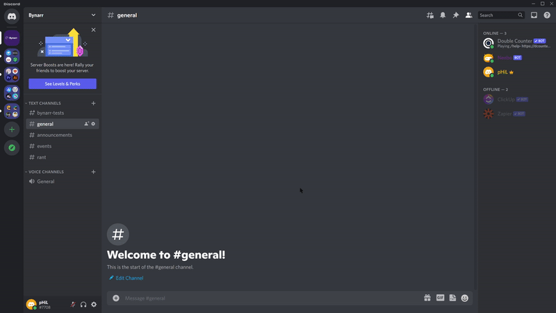

<p align="center"></p>
<h1 align="center">Neebo</h1>
<p align="center">
  <a href="https://github.com/kimathi-phil/neebo/actions/workflows/ci.yaml"></a>
  <!-- <a href="https://codecov.io/gh/kimathi-phil/neebo"></a> -->
  <a href="https://github.com/kimathi-phil/neebo/blob/main/LICENSE"></a>
  <a href="https://github.com/rust-lang/rust/releases"></a>
</p>
<p align="center">[WIP] A simple Discord bot written in Rust 🏗</p>

## Features
Commands currently supported by Neebo:

### Help
Summons Neebo for assistance
```
?help
```
`Demo`



### Ban
Ban a user
```
?ban {user}
```
### Kick
Kick a user
```
?kick {user}
```

### Code of Conduct
Displays the code of conduct in the specified channel
```
?CoC {channel}
```
<br />

More features to come...

---
